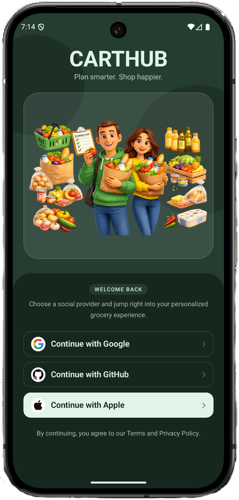

# CartHub

**Plan smarter. Shop happier.**

CartHub is a cross-platform grocery planning app built with [Expo](https://expo.dev/) and [React Native](https://reactnative.dev/). Sign in with your preferred provider, manage your list, plan items, and see insights—all in one place.



## Repository

**GitHub:** [https://github.com/aniltanriverdiler/cart-hub-expo](https://github.com/aniltanriverdiler/cart-hub-expo.git)

```bash
git clone https://github.com/aniltanriverdiler/cart-hub-expo.git
cd cart-hub-expo
```

## Features

- **Authentication** — [Clerk](https://clerk.com/) with social sign-in (Google, GitHub, Apple) and an onboarding-style welcome screen.
- **Grocery list** — Browse and update items synced via server API routes.
- **Planner** — Add and organize grocery items with categories and priorities.
- **Insights** — Summary views for stats, categories, and priorities; optional feedback integration with [Sentry](https://sentry.io/).
- **Data layer** — [Neon](https://neon.tech/) Postgres with [Drizzle ORM](https://orm.drizzle.team/); seed script for sample data.

## Tech stack

| Area | Choices |
|------|---------|
| App | Expo ~55, React 19, React Native, [Expo Router](https://docs.expo.dev/router/introduction/) (file-based routing) |
| Styling | [NativeWind](https://www.nativewind.dev/) (Tailwind for React Native) |
| Auth | `@clerk/expo` |
| Database | Drizzle ORM + `@neondatabase/serverless` |
| Monitoring | `@sentry/react-native` (optional, via env) |
| State | Zustand (client store for grocery data) |

## Project structure (high level)

```
cart-hub-expo/
├── src/
│   ├── app/                 # Expo Router: layouts, tabs, auth, API routes
│   │   ├── (auth)/          # Sign-in flow
│   │   ├── (tabs)/          # List, Planner, Insights
│   │   └── api/             # Server routes for grocery items
│   ├── components/          # UI (e.g. planner, insights)
│   ├── hooks/
│   ├── lib/server/          # DB client, Drizzle schema, server actions
│   └── store/
├── assets/images/           # Icons, splash, auth art, login preview
├── scripts/                 # e.g. seed-grocery.cjs
├── drizzle.config.ts
├── app.json
└── package.json
```

## Prerequisites

- **Node.js** 18+ (recommended)
- A **Clerk** application with Expo configured (publishable key).
- A **Neon** (or compatible) Postgres URL for API routes that use the database.
- For native builds: Xcode (iOS) and/or Android Studio (Android), or use Expo’s cloud/prebuild workflow as documented by Expo.

## Environment variables

Create a `.env.local` (or configure your host) with at least:

| Variable | Purpose |
|----------|---------|
| `EXPO_PUBLIC_CLERK_PUBLISHABLE_KEY` | Clerk publishable key for the app |
| `DATABASE_URL` | Postgres connection string for Drizzle / API routes |
| `EXPO_PUBLIC_SENTRY_DSN` | *(Optional)* Sentry DSN for error reporting |

Never commit real secrets. Use your team’s secret management in CI and production.

## Setup

1. **Install dependencies** (the repo includes a `bun.lock`; use npm, Bun, yarn, or pnpm):

   ```bash
   npm install
   ```

2. **Configure environment** — add the variables above so Clerk and the database work locally.

3. **Database** — push schema with Drizzle when your `DATABASE_URL` is set:

   ```bash
   npm run db:push
   ```

4. **Seed sample groceries** *(optional)*:

   ```bash
   npm run seed:grocery
   ```

5. **Start the dev server**:

   ```bash
   npm start
   ```

   Then open the app in an iOS simulator, Android emulator, or web as prompted by the Expo CLI.

### Scripts

| Command | Description |
|---------|-------------|
| `npm start` | Start Expo dev server |
| `npm run ios` / `npm run android` | Run native builds (requires dev environment) |
| `npm run web` | Start with web target |
| `npm run lint` | Run Expo lint |
| `npm run db:push` | Push Drizzle schema to the database |
| `npm run seed:grocery` | Seed grocery sample data |

## Development notes

- **Routing** — Auth vs. main app is handled in layouts; signed-out users are redirected to sign-in.
- **API** — Grocery operations go through `src/app/api/` routes backed by Drizzle and Neon.
- **Typed routes** — Expo Router typed routes are enabled in `app.json` experiments.

## Contributing

Fork the repository, create a branch for your change, and open a pull request with a short description of what you changed and why.

## License

This project does not include a default license file in the repository. Add a `LICENSE` if you intend to distribute or open-source the code under specific terms.

## Resources

- [Expo documentation](https://docs.expo.dev/)
- [Expo Router](https://docs.expo.dev/router/introduction/)
- [Clerk Expo](https://clerk.com/docs/quickstarts/expo)
- [Drizzle ORM](https://orm.drizzle.team/docs/overview)
